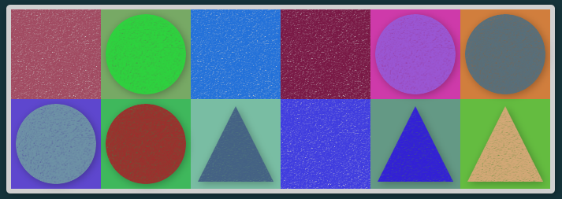

# Lines, Shapes, & Colors

Hello! I decided to have some fun programmatically creating geometric art. I've always been a fan of abstract art that features sharp lines, solid shapes, & vibrant colors. It's clean, it's calming, and it's accessible. With code, we can procedurally draw some dynamic and (hopefully) aesthetically pleasing artscapes. Thank you for taking a look!

This repo comprises a React app that serves as a directory for several different artscapes (just one so far :smile:). Each artscape has a simple directive: given a few guidelines, randomly draw some neat, interesting geometric art. React serves to provide some heirarchy & structure to each artscape and to the project as a whole, but CSS might just be the star of the show.

## Artscapes

### 1. Shape Gallery

See the sample image at the top. Draws some orderly rows of shapes: squares, circles, and triangles. Each shape will animate between two random colors. The result is a simple yet hypnotic wall of color.

#### How It Works
First, we calculate how many rows and columns of cells to render. This is based on the screen size, however screen size breakpoints are implemented to ensure that it draws a fair amount of shapes on smaller screens as well. Then, we decide which shape to place into each cell. There are equal odds that the shape will be a square, circle, or triangle. Next, we assign two random colors to each shape (and two random background colors - for circles and triangles). Finally, we draw the shape and add animations (keyframes) to the DOM to fade between the two colors in perpetuity.

---------------
*Created by Andrew Croul, 2023*
